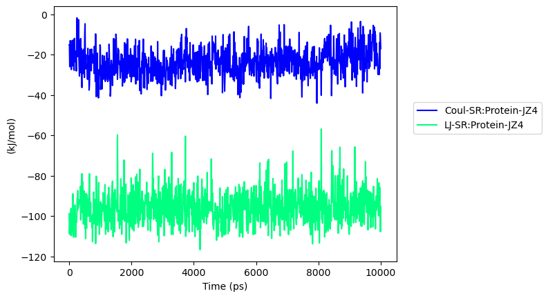

# gmxpy

[](https://badge.fury.io/py/gmxpy) 
[](https://badge.fury.io/py/gmxpy)
[](https://img.shields.io/pypi/l/ansicolortags.svg) 


Author: Goosang Yu  
Contact: gsyu93@gmali.com  

Wrapping GROMACS by python script for me  
Since 2023. 07. 12.  
Tested GROMCAS ver. 2023.1

## Installation

```python
pip install gmxpy
```
*This package does not include GROMACS. You need to install GROMCAS separately. Also, gmxpy is currently being developed based on GROMACS version 2023.1. If you use a version that is too old, it may not be compatible.*

## You don need to use XMGRACE anymore!
GROMACS by default generates graphs of data in the form of xmgrace files (.xvg). Xmgrace produces visually appealing plots, but it can be cumbersome to handle in different languages or operating systems. The most important thing is that I am not familiar with it.

One of the functions included in gmxpy, called 'xvg2df', converts it into a much simpler DataFrame format.

```python
import gmxpy as gmx

df_xvg = gmx.xvg2df('interaction_energy.xvg')
df_xvg()
```
|           | Coul-SR:Protein-JZ4 | LJ-SR:Protein-JZ4 |
| --------- | ------------------- | ----------------- |
| Time (ps) |                     |                   |
| 0         | \-15.2106           | \-98.9382         |
| 10        | \-15.5369           | \-108.834         |
| 20        | \-26.0345           | \-105.193         |
| 30        | \-13.2364           | \-108.948         |
| 40        | \-13.0772           | \-109.427         |

With just a little additional effort, it can be conveniently plotted and visualized as a graph. I have freely chosen the colors that I personally like.

```python
df_xvg().plot()
```

